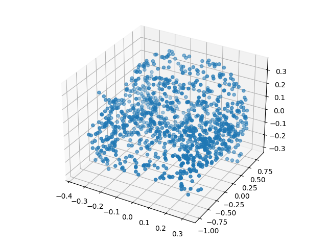
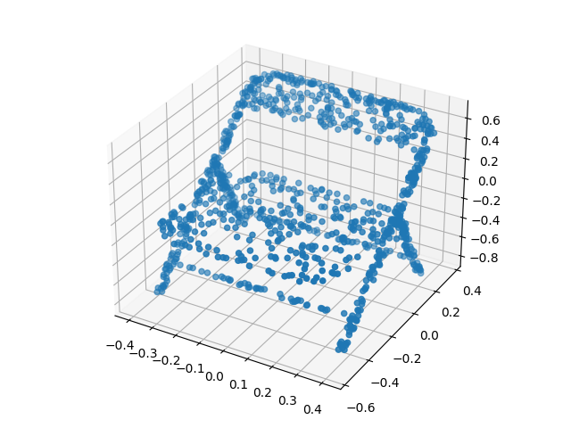
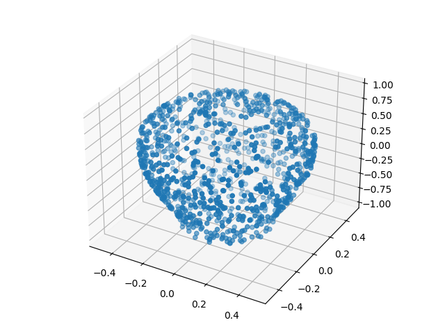

# Neural Shape Analysis

This project addresses the task of shape classification of point clouds on ModelNet40 benchmark [[1]](#references)
It is heavily based on PointNet [[2]](#references) and Momenet [[3]](#references), which introduces the usage of geometric moments as input features.
The implementation is in Tensorflow and includes `tf.data.Dataset` mapping functions to compute the geometric moments, pre-liftings and vertex normals.

<p align="center">
  
  
  
</p>

<p align="center">
 <em> Samples from ModelNet40 benchmark after sampling 2048 points and normalizing to the
unit sphere </em>
</p>

## Setup
You can create the project's environment from the `nsa.yml` file by running:
```
conda env create -f nsa.yml
```
The point clout vertex normals is based on the Point Cloud Utils ([pcu](https://github.com/fwilliams/point-cloud-utils)) package.

## References
[1] [3D ShapeNets: A Deep Representation for Volumetric Shapes, Z. Wu et al., 2015](https://arxiv.org/pdf/1406.5670.pdf)

[2] [PointNet: Deep Learning on Point Sets for 3D Classification and Segmentation, C. Qi et al., 2016](https://arxiv.org/pdf/1612.00593.pdf)

[3] [Momen(e)t: Flavor the Moments in Learning to Classify Shapes, M. Joseph-Rivlin et al, 2019](https://arxiv.org/pdf/1812.07431.pdf)
 
